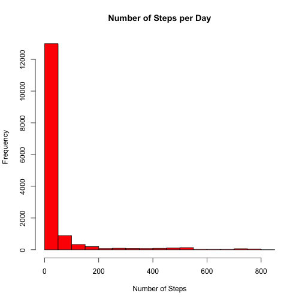
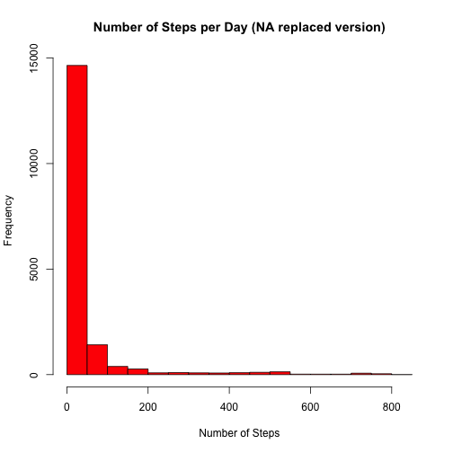

This report is for Coursera Johns Hopkins Data Science Specialization, Reproducible Research peer assessment 1. 

This report makes use of data from a personal activity monitoring device, that collects data at 5 minute intervals throughout the day. The data was collected during the months of October and November, 2012.

The variables included in this dataset are:

- **steps**: Number of steps taking in a 5-minute interval (missing values are coded as NA)

- **date**: The date on which the measurement was taken in YYYY-MM-DD format

- **interval**: Identifier for the 5-minute interval in which measurement was taken

The dataset is stored in a comma-separated-value (CSV) file and there are a total of 17,568 observations in this dataset.

##Loading and preprocessing the data
The following code loads the data into R. The location of the file given in the code is merely an example and one should replace it with wherever one has saved the datafile on their computer. 


```r
data <- read.csv("~/desktop/activity.csv")
```

Any procesing of the data will be done throughout the analysis as necessary.

##Mean total number of steps taken per day
The following code produces a histogram of the total number of steps taken each day.


```r
hist(data$steps, col="red", xlab="Number of Steps", ylab="Frequency", main="Number of Steps per Day")
```

 

The mean and median of the total number of steps taken per day can be calculated:


```r
mean(data$steps, na.rm=TRUE)
```

```
## [1] 37.38
```

```r
median(data$steps, na.rm=TRUE)
```

```
## [1] 0
```

##The average daily activity pattern
The following code makes a time series plt of the 5-minute interval (x-axis) and the average number of steps taken, averaged across all days (y-axis). 


```r
stepmean <- sapply(split(data$steps, data$interval), mean, na.rm=TRUE)
plot(stepmean, type="l", ylab="Average number of steps", xlab="Interval", xaxt="n")
axis(1, at=c(0,61,121,181,241), labels=c("0","500","1000","1500","2000"))
```

 

To see which 5-minute interval, on average across all the days in the dataset, contains the maximum number of steps run the following code:


```r
names(which.max(stepmean))
```

```
## [1] "835"
```

##Inputing missing values
There are a number of days/intervals in the dataset where there are missing values, coded as NA. These may introduce bias into some calculatins or summaries of the data.

First, calculate the total number of missing values in the dataset:


```r
sum(!complete.cases(data))
```

```
## [1] 2304
```

Then, a strategy can be used to fill in all of the missing values in the dataset. There are multiple possibilities for the strategy to be used, but here we will substitute the NA values with the mean value for that 5-minute interval. The following code creates a data frame called noNAdata that is identical to the original data set except that the NA values have been substituted.


```r
stepmean2 <- as.data.frame(stepmean)

strategy <- function(x){
  rn <- as.numeric(row.names(x))
  int <- as.numeric(x[3])
  if(is.na(x[1])==TRUE){
    data$steps<-stepmean2[paste(int),1]
  }else{
    data$steps<-x[1]
  }
} 
noNAdata <- data
noNAdata$steps <- as.numeric(apply(data, MARGIN=1, FUN=strategy))
```

Then, we will create a histogram, and compute the mean and the median just like we did before:


```r
hist(noNAdata$steps, col="red", xlab="Number of Steps", ylab="Frequency", main="Number of Steps per Day (NA replaced version)")
```

 


```r
mean(noNAdata$steps)
```

```
## [1] 37.38
```

```r
median(noNAdata$steps)
```

```
## [1] 0
```

You can tell that the strategy had little effect on the overall distribution of the data, since the new histogram is graphically very similar to the one created before (except that the individual bars are longer, since there are more entries taken in account). Also the mean and the median values have not been affected. 

##Difference in activity patterns between weekdays and weekends
The following code creates a new factor variable in the dataset with two level- "weekday" and "weekend" indicating whether a given date is a weekday or weekend day.


```r
noNAdata$day <- weekdays(as.Date(noNAdata$date))

test <- function(x){
if((x[4] %in% c("Monday", "Tuesday", "Wednesday", "Thursday", "Friday"))==TRUE){
  noNAdata$day <- "weekday"
} else {
  noNAdata$day <- "weekend"
}
}

noNAdata$day <- as.factor(apply(noNAdata, MARGIN=1, FUN=test))
```

Then, the following set of codes creates a panel plot containing a time series plot of the 5-minute interval (x-axis) and hte average number of steps taken, averaged across all weekdays or weekend days(y-axis).


```r
weekday <- subset(noNAdata, day=="weekday")
weekend <- subset(noNAdata, day=="weekend")
meanweekday <- sapply(split(weekday$steps, data$interval), mean)
```

```
## Warning: data length is not a multiple of split variable
```

```r
meanweekday <- as.data.frame(meanweekday)
meanweekday$day <- "weekday"
meanweekday$interval <- as.numeric(rownames(meanweekday))
colnames(meanweekday)<-c("mean", "day", "interval")
meanweekend <- sapply(split(weekend$steps, data$interval), mean)
```

```
## Warning: data length is not a multiple of split variable
```

```r
meanweekend <- as.data.frame(meanweekend)
meanweekend$day <- "weekend"
meanweekend$interval <- as.numeric(rownames(meanweekend))
colnames(meanweekend)<-c("mean","day", "interval")

weekmean<-rbind(meanweekday, meanweekend)

library(lattice)
xyplot(mean ~ interval | day, data=weekmean, type="l", layout=c(1,2), ylab="Number of steps")
```

 
